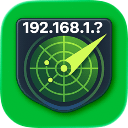
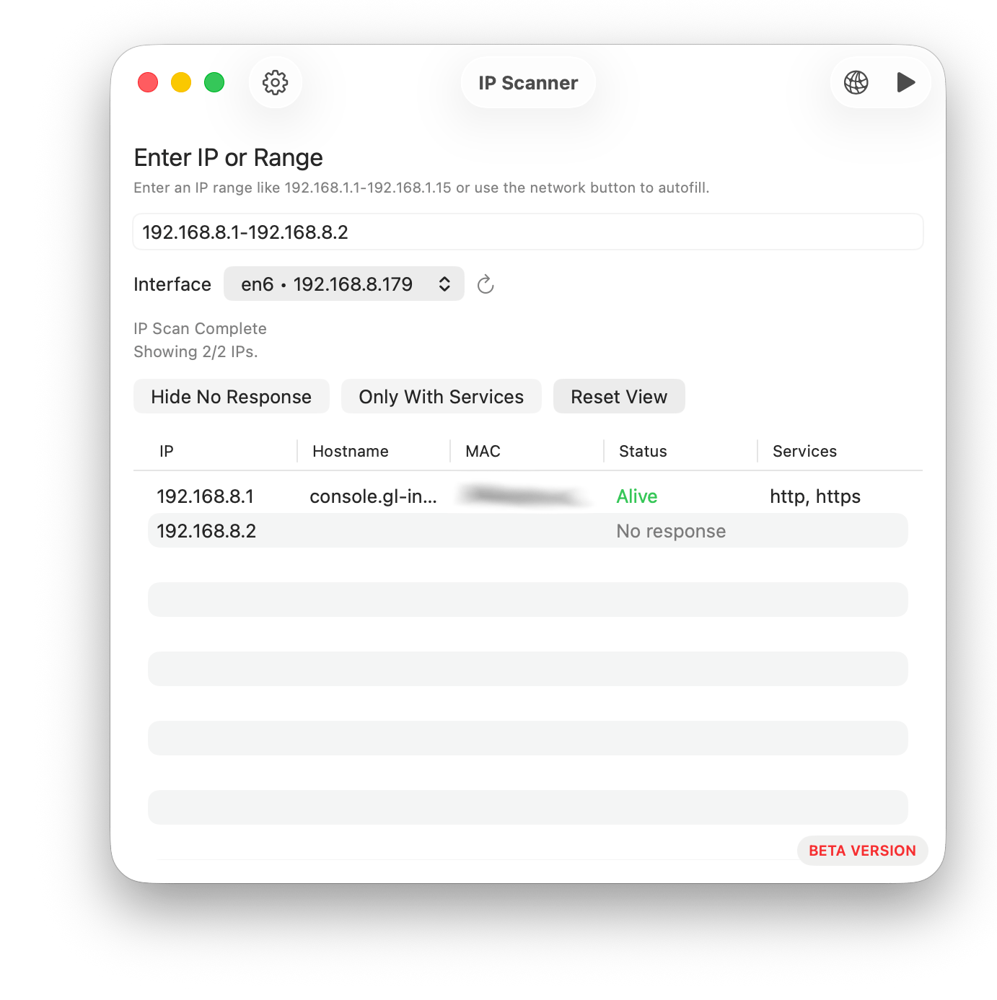

<div align="center">

<picture>
  <source srcset="Documentation/icon-dark.png" media="(prefers-color-scheme: dark)">
  <source srcset="Documentation/icon-light.png" media="(prefers-color-scheme: light)">
  
</picture>
<br/><br/>

<br>
<p><b>IP Scanner is a macOS app for scanning IP ranges, resolving hostnames, and reporting open services.</b></p>

</div>

<p align="center">
    <a href="Documentation/App1.png"></a>
</p>

## Features
- Scan a single IP or range (for example `192.168.1.1-192.168.1.15`).
- Show hostname, reachability, and detected services.
- Filter results by reachability or by presence of services.
- Export results to CSV.
- Manage default and custom service definitions.
- Add custom services and export/import them as JSON.

## Usage
1. Enter an IP or range in the main window.
2. Check Settings to ensure you are scanning the right services. 
3. Click Scan to start.
4. Use filters to refine the table.
5. Use the menu bar to export results or manage services.

## Services Export
Custom services can be imported/exported from the Services menu. 

JSON schema (each entry in the array is a service):
```json
[
  {
    "name": "My Service",
    "port": 1234,
    "isEnabled": true
  }
]
```

Notes:
- `name` is a human-friendly label.
- `port` is the port number (TCP).
- `isEnabled` controls whether the service is used during scans.

## Default Services
The app ships with the following default services (name: port):
- http: 80
- https: 443
- ssh: 22
- smb: 445
- netbios: 139
- rdp: 3389
- vnc: 5900
- mqtt: 1883
- mqtts: 8883
- mysql: 3306
- postgres: 5432
- redis: 6379
- ftp: 21
- smtp: 25
- imap: 143
- imaps: 993

## 🖥️ Install & Minimum Requirements

- macOS 14.0 or later  
- Apple Silicon & Intel (not tested on Intel)
- ~10 MB free disk space  

### ⚙️ Installation

Download from Releases. It's signed & notarized.

### ⚙️ Build it yourself!

Clone the repo and build with Xcode:

```bash
git clone https://github.com/gbabichev/IP-Scanner.git
```

## 📝 Changelog

### 1.0.0 Build 2
- Added text that shows how many hosts are alive after a scan.

### 1.0.0
- Initial release

## 📄 License

MIT — free for personal and commercial use. 
